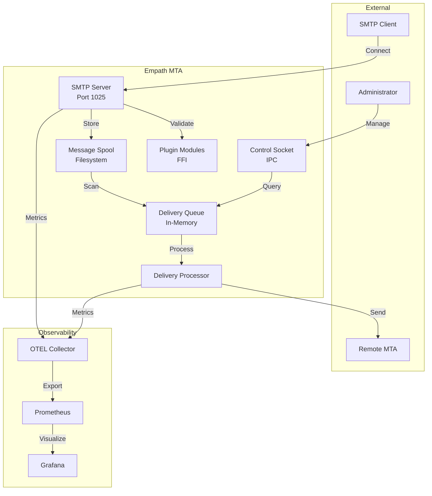
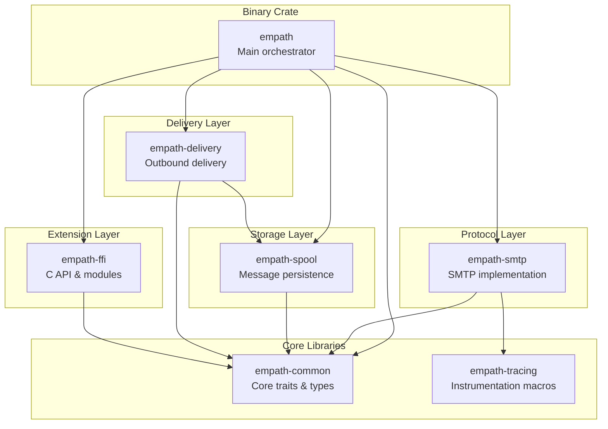
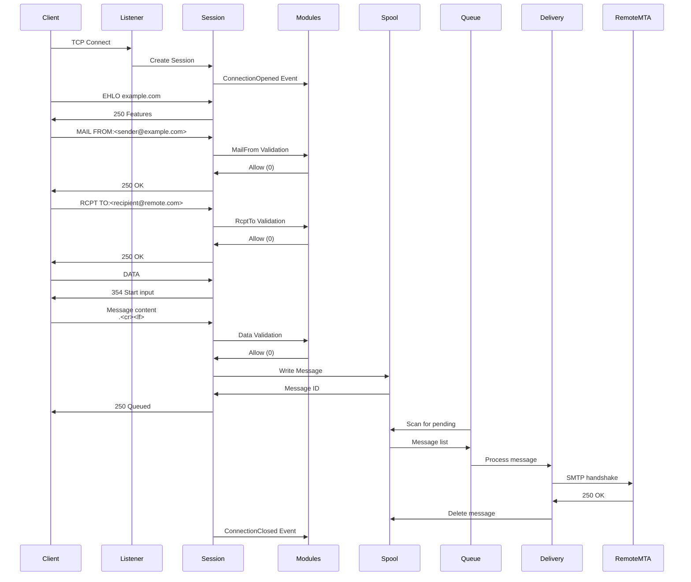
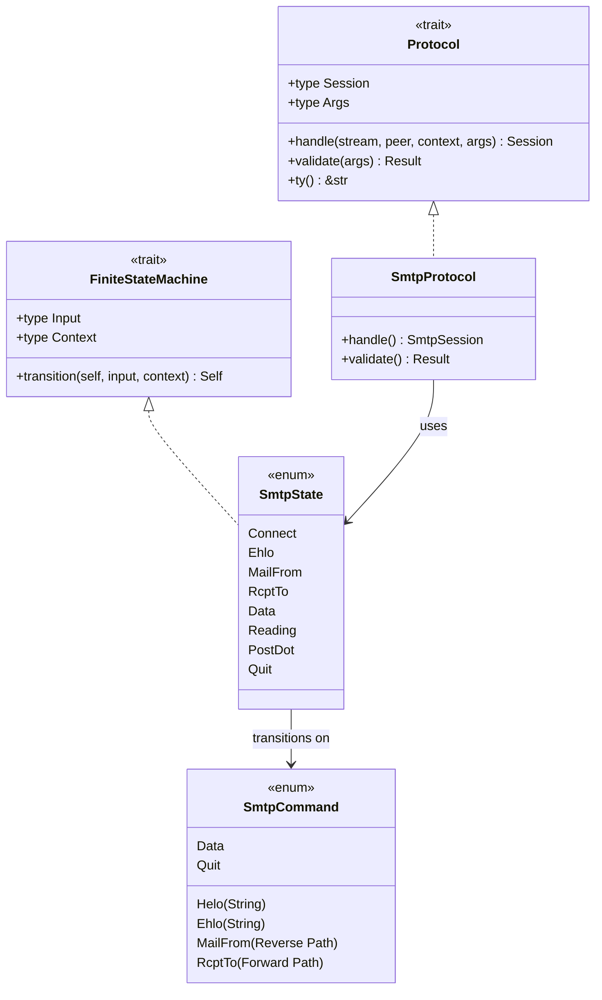
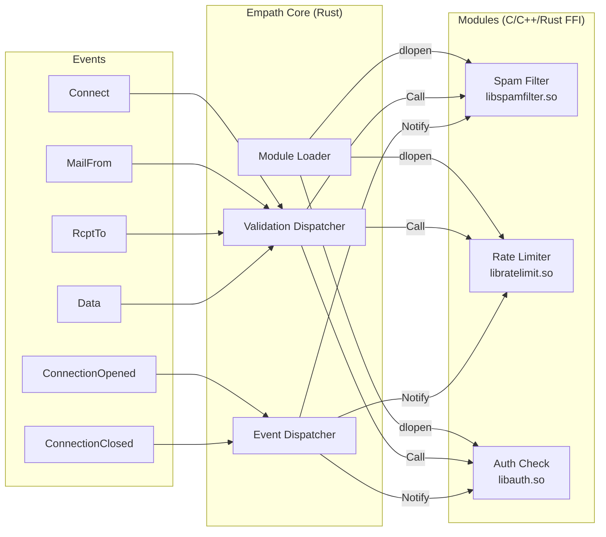
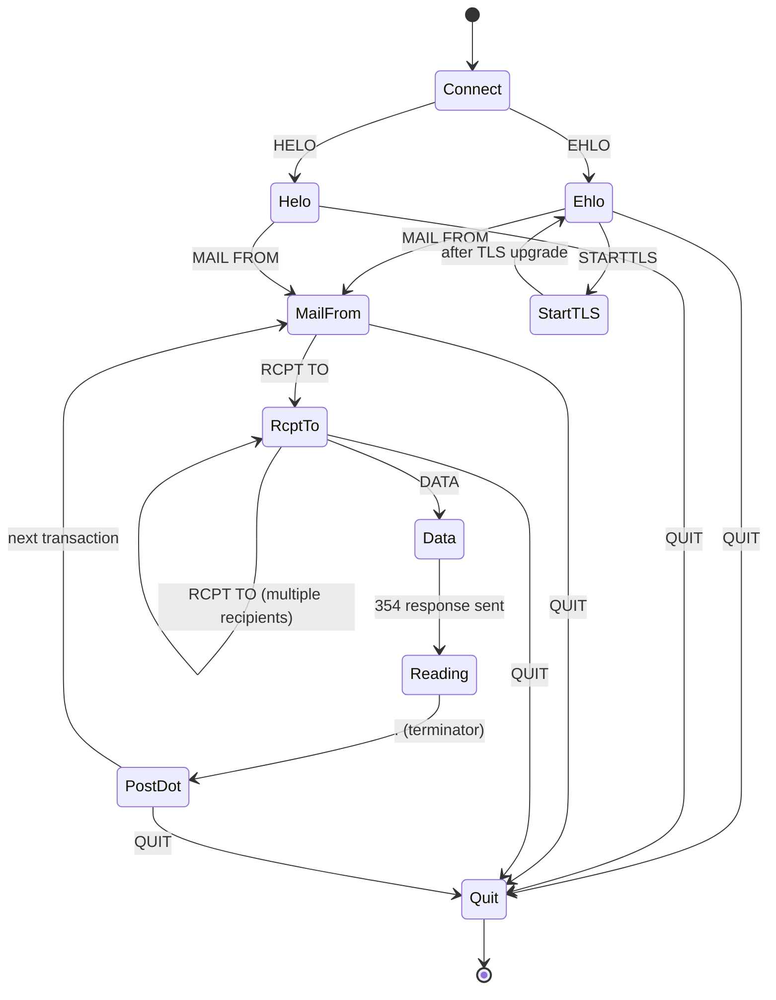
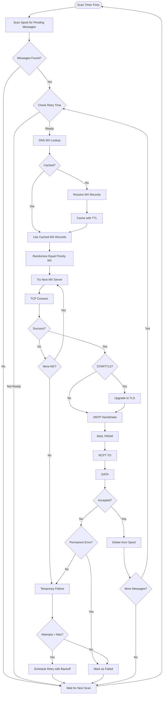
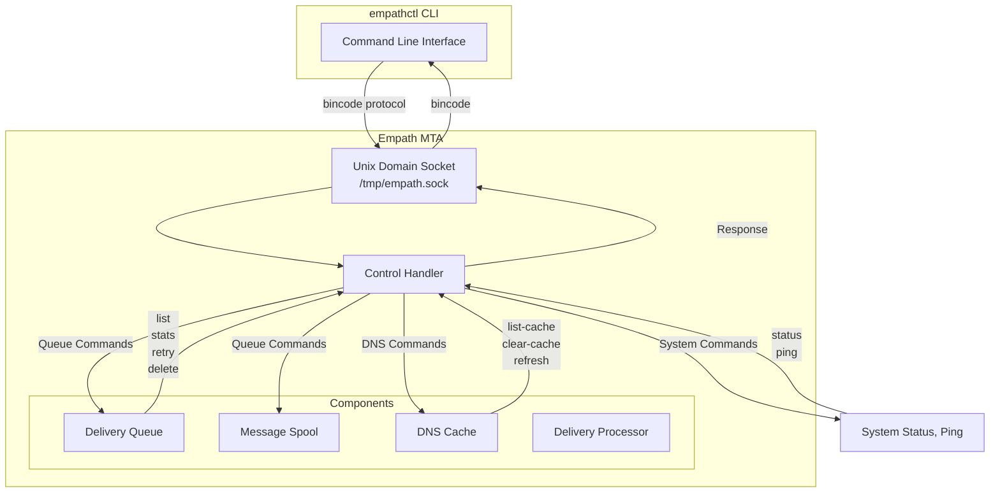
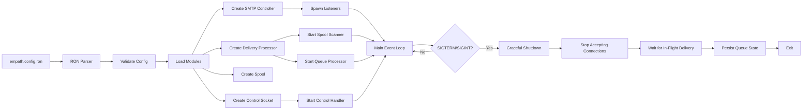
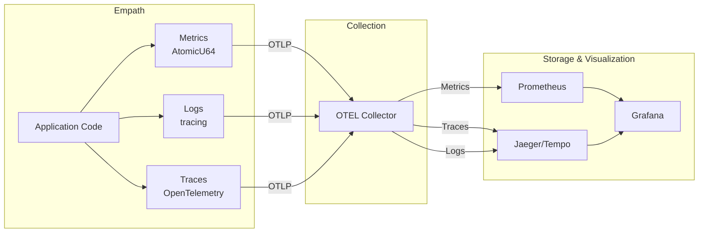

# Empath MTA Architecture

This document provides a visual overview of Empath's architecture using diagrams. For detailed implementation details, see [CLAUDE.md](../CLAUDE.md).

## Table of Contents

- [High-Level Overview](#high-level-overview)
- [Component Architecture](#component-architecture)
- [Data Flow](#data-flow)
- [Workspace Structure](#workspace-structure)
- [Protocol System](#protocol-system)
- [Module/Plugin System](#moduleplugin-system)
- [SMTP State Machine](#smtp-state-machine)
- [Delivery Pipeline](#delivery-pipeline)
- [Control System](#control-system)

---

## High-Level Overview

Empath is a modular Mail Transfer Agent (MTA) built with Rust, designed for:
- **Easy debugging and testing**
- **Extensibility through plugins** (FFI-based module system)
- **Production-ready observability** (OpenTelemetry, Prometheus, Grafana)
- **Embeddability** (produces cdylib for each crate)



---

## Component Architecture

### 7-Crate Workspace



**Crate Responsibilities:**

- **empath**: Main binary, configuration, controller orchestration
- **empath-common**: Core abstractions (Protocol, FSM, Controller, Listener traits)
- **empath-smtp**: SMTP protocol implementation with finite state machine
- **empath-delivery**: Outbound mail delivery queue and processor
- **empath-spool**: Message persistence to filesystem with watching
- **empath-ffi**: C-compatible API for embedding and dynamic modules
- **empath-tracing**: `#[traced]` procedural macro for instrumentation

---

## Data Flow

### Message Reception and Delivery



---

## Workspace Structure

### File Organization

```
empath/
├── empath/                    # Main binary crate
│   ├── src/
│   │   ├── main.rs           # Entry point
│   │   ├── config.rs         # Configuration parsing
│   │   └── control_handler.rs # Control socket IPC
│   └── Cargo.toml
│
├── empath-common/            # Core abstractions
│   ├── src/
│   │   ├── traits/
│   │   │   ├── protocol.rs   # Protocol trait
│   │   │   ├── fsm.rs        # FiniteStateMachine trait
│   │   │   └── ...
│   │   ├── context.rs        # Message context
│   │   ├── controller.rs     # Multi-listener controller
│   │   └── listener.rs       # Single-listener handler
│   └── Cargo.toml
│
├── empath-smtp/              # SMTP protocol
│   ├── src/
│   │   ├── lib.rs            # Protocol impl & FSM
│   │   ├── session.rs        # Session handler
│   │   ├── command.rs        # Command parsing
│   │   └── extensions/       # STARTTLS, SIZE, etc.
│   ├── benches/              # Performance benchmarks
│   └── Cargo.toml
│
├── empath-delivery/          # Outbound delivery
│   ├── src/
│   │   ├── lib.rs            # Delivery processor
│   │   ├── queue/            # Queue management
│   │   ├── dns.rs            # MX lookup
│   │   └── processor/        # Delivery logic
│   └── Cargo.toml
│
├── empath-spool/             # Message persistence
│   ├── src/
│   │   ├── spool.rs          # Spool trait
│   │   └── backends/
│   │       ├── file.rs       # Filesystem backend
│   │       └── memory.rs     # In-memory backend
│   └── Cargo.toml
│
├── empath-ffi/               # C API & modules
│   ├── src/
│   │   ├── lib.rs            # C exports
│   │   ├── modules/          # Module loading
│   │   └── string.rs         # FFI string types
│   ├── examples/
│   │   ├── example.c         # Validation module
│   │   └── event.c           # Event listener
│   └── Cargo.toml
│
└── empath-tracing/           # Instrumentation
    ├── src/lib.rs            # #[traced] macro
    └── Cargo.toml
```

---

## Protocol System

### Generic Protocol Architecture

The protocol system is generic, allowing new protocols (IMAP, POP3, etc.) to be added easily.



**Key Concepts:**

- **Protocol trait**: Defines how to handle connections for a specific protocol
- **FiniteStateMachine trait**: Defines state transitions based on inputs
- **SmtpProtocol**: Concrete implementation for SMTP
- **Generic infrastructure**: Controller and Listener are generic over Protocol type

---

## Module/Plugin System

### FFI-Based Extension Architecture



**Module Types:**

1. **ValidationListener**: SMTP transaction validation
   - Return 0 = accept, non-zero = reject
   - Events: Connect, MailFrom, RcptTo, Data, StartTls

2. **EventListener**: Lifecycle notifications
   - Events: ConnectionOpened, ConnectionClosed

**Module Interface** (C API):
```c
Mod* declare_module(void);

typedef struct Mod {
    const char* name;
    int (*on_mail_from)(Context* ctx);
    int (*on_rcpt_to)(Context* ctx);
    // ...
} Mod;
```

---

## SMTP State Machine

### State Transitions



**State Validation:**

Each transition is validated by the module system:
- Modules can reject transitions by returning non-zero
- First module to reject wins
- Context is preserved across transitions

---

## Delivery Pipeline

### Outbound Message Processing



**Retry Schedule (Exponential Backoff):**
```
Attempt 1: Immediate
Attempt 2: 30 seconds
Attempt 3: 2 minutes
Attempt 4: 8 minutes
Attempt 5: 30 minutes
Attempt 6+: 1 hour each
Max: 25 attempts
```

---

## Control System

### Runtime Management via IPC



**Available Commands:**

**DNS Management:**
- `dns list-cache` - List cached MX records
- `dns clear-cache` - Clear entire DNS cache
- `dns refresh <domain>` - Refresh specific domain
- `dns list-overrides` - List MX overrides

**Queue Management:**
- `queue list [--status=<status>]` - List messages
- `queue view <message-id>` - View message details
- `queue stats [--watch]` - Queue statistics
- `queue retry <message-id>` - Retry failed message
- `queue delete <message-id>` - Delete message
- `queue freeze` - Pause delivery
- `queue unfreeze` - Resume delivery

**System:**
- `system ping` - Health check
- `system status` - System status and metrics

---

## Key Architectural Patterns

### 1. Generic Protocol System
- `Controller<Proto: Protocol>` and `Listener<Proto: Protocol>` are generic
- New protocols implement the `Protocol` trait
- Reusable connection handling infrastructure

### 2. Finite State Machine
- States have explicit types (not strings/enums with data)
- Transitions are type-safe
- Invalid transitions caught at compile time

### 3. Module/Plugin System
- C FFI for language-agnostic extensions
- Synchronous dispatch (all modules called sequentially)
- First non-zero return rejects transaction

### 4. Controller/Listener Pattern
- Controller manages multiple listeners
- Broadcasts shutdown signals
- Coordinated graceful shutdown

### 5. Spool Abstraction
- `Spool` trait for different backends
- `FileBackedSpool` for production
- `MemoryBackedSpool` for testing

---

## Configuration Flow



---

## Performance Considerations

### Optimizations

1. **Lock-Free Concurrency**: DashMap instead of `Arc<RwLock<HashMap>>`
2. **Zero-Copy Parsing**: Minimize allocations in hot paths
3. **Connection Pooling**: Reuse SMTP connections (planned)
4. **DNS Caching**: TTL-based with active eviction
5. **Metrics**: AtomicU64 counters (~90% overhead reduction)

### Benchmarks

- Command parsing: ~100-500ns
- FSM transitions: ~50-200ns
- Spool operations: ~10-50µs
- Full SMTP transaction: ~1-5ms

See [CLAUDE.md Benchmarking section](../CLAUDE.md#benchmarking) for details.

---

## Security Architecture

### Defense in Depth

1. **TLS Certificate Validation**: Enabled by default (configurable per-domain)
2. **Timeout Protection**: State-aware timeouts (RFC 5321 compliant)
3. **Module Sandboxing**: Modules run in-process but validated
4. **Control Socket Security**: Unix permissions, audit logging
5. **Input Validation**: Strict SMTP command parsing
6. **Resource Limits**: Connection limits, message size limits

See [CLAUDE.md Security Considerations](../CLAUDE.md#security-considerations) for details.

---

## Observability

### Metrics, Logs, and Traces



**Key Metrics:**
- `empath_connections_total` - Total SMTP connections
- `empath_messages_received` - Messages accepted
- `empath_delivery_attempts_total` - Delivery attempts by domain/status
- `dns_cache_hits` / `dns_cache_misses` - DNS cache effectiveness

---

## Further Reading

- [README.md](../README.md) - Project overview and quick start
- [CLAUDE.md](../CLAUDE.md) - Detailed implementation guide
- [docs/ONBOARDING.md](ONBOARDING.md) - New developer guide
- [docs/TROUBLESHOOTING.md](TROUBLESHOOTING.md) - Common issues
- [CONTRIBUTING.md](../CONTRIBUTING.md) - Contribution guidelines
